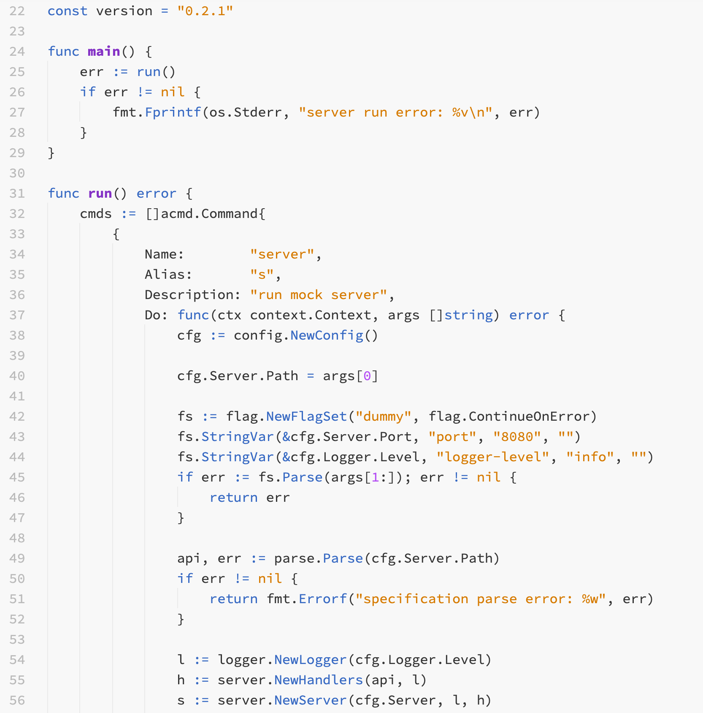

# ⚡️ Coder Pro

This theme is forked from Brackets Light by [EryouHao](https://github.com/EryouHao/brackets-light-pro). There are a number of syntax highlighting changes, such that it no longer reflects the original theme.

An example, using Golang:

Click [here](https://code.visualstudio.com/api/references/theme-color) to see all configurable settings related to VS Code.

Coder Pro Max comes from: 

https://github.com/microsoft/vscode/tree/main/extensions/theme-solarized-light